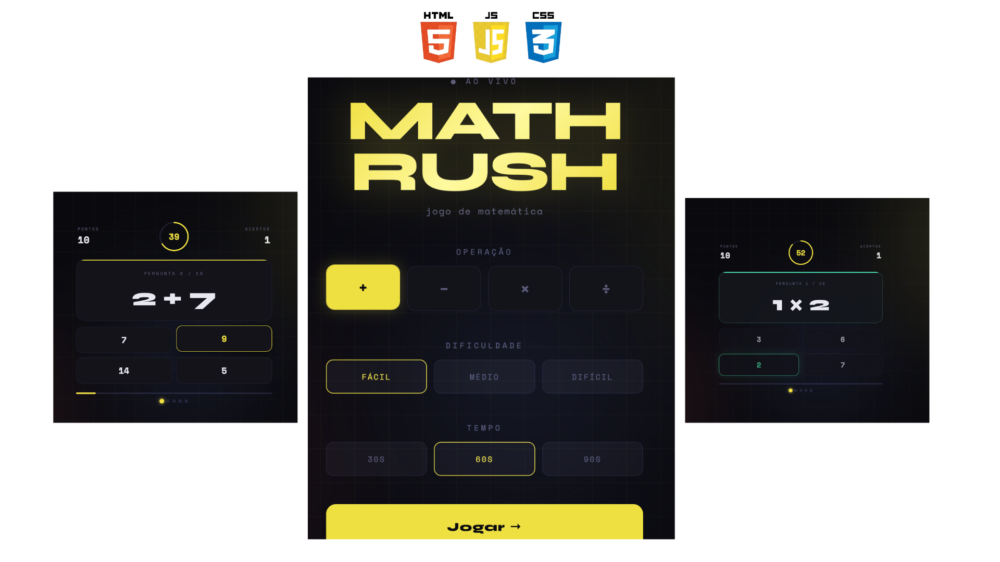

<div align="center">

# 🧮 MathRush

**Jogo de matemática rápido e viciante — teste seus reflexos com números!**

[](https://developer.mozilla.org/docs/Web/HTML)
[](https://developer.mozilla.org/docs/Web/CSS)
[](https://developer.mozilla.org/docs/Web/JavaScript)

🔗 **[Jogar agora →](https://jonebulande.github.io/BasicMathGame/)**

</div>

<p align="center">
  
</p>

---

## 📖 Sobre o projeto

O **MathRush** é um jogo de matemática para o browser feito com HTML, CSS e JavaScript puros — sem frameworks, sem dependências.  
O objetivo é responder o máximo de questões corretas dentro do tempo limite, acumulando pontos com o sistema de **sequência (streak)**.

---

## ✨ Funcionalidades

| Feature | Descrição |
|---|---|
| ➕ ➖ ✖️ ➗ | Quatro operações matemáticas disponíveis |
| ⏱️ Timer circular | Conta regressiva visual que muda de cor conforme o tempo acaba |
| 🏆 Placar dinâmico | Pontuação com multiplicador de sequência (até 5×) |
| 🔥 Streak | 5 indicadores visuais que acendem a cada acerto seguido |
| 🎯 Dificuldade | Três níveis: Fácil, Médio e Difícil |
| ⏳ Tempo configurável | Escolha entre 30s, 60s ou 90s por partida |
| 🎊 Confetti | Animação de celebração para desempenho acima de 70% |
| 📱 Responsivo | Funciona em celular e desktop |

---

## 🗂️ Estrutura do projeto

```
BasicMathGame/
│
├── index.html   # Estrutura das telas (início, jogo, resultado)
├── style.css    # Todo o visual: layout, cores, animações
├── game.js      # Lógica do jogo: geração de perguntas, timer, pontuação
└── README.md
```

---

## 🎮 Como jogar

1. **Escolha a operação** — adição, subtração, multiplicação ou divisão
2. **Escolha a dificuldade** — Fácil (1–12), Médio (5–50) ou Difícil (10–100)
3. **Escolha o tempo** — 30, 60 ou 90 segundos
4. Clique em **Jogar** e responda as questões o mais rápido que puder!
5. Acertos seguidos aumentam seu **multiplicador de pontos** (até 5×)

---

## 🧮 Sistema de pontuação

```
Pontos por acerto = 10 × multiplicador de sequência

Sequência 1 acerto  →  10 pts
Sequência 2 acertos →  20 pts
Sequência 3 acertos →  30 pts
Sequência 4 acertos →  40 pts
Sequência 5+ acertos → 50 pts  (máximo)
```

Errar uma questão **zera a sequência**.

---

## 🚀 Rodando localmente

Não precisa de servidor! Basta clonar e abrir o arquivo no browser:

```bash
git clone https://github.com/JoneBulande/BasicMathGame.git
cd BasicMathGame

# Abra diretamente no browser:
open index.html          # macOS
start index.html         # Windows
xdg-open index.html      # Linux
```

Ou use a extensão **Live Server** no VS Code para hot-reload durante o desenvolvimento.

---

## 🛠️ Tecnologias

- **HTML5** — estrutura semântica das três telas do jogo
- **CSS3** — variáveis, grid, animações (`@keyframes`), SVG styling
- **JavaScript (ES6+)** — lógica do jogo, geração de questões, timer, DOM manipulation

---

## 🤝 Contribuindo

Contribuições são bem-vindas! Siga os passos:

```bash
# 1. Faça um fork do projeto
# 2. Crie uma branch para a sua feature
git checkout -b feature/minha-melhoria

# 3. Faça o commit das suas alterações
git commit -m "feat: adiciona modo multiplayer"

# 4. Envie para o repositório remoto
git push origin feature/minha-melhoria

# 5. Abra um Pull Request
```

### Ideias para contribuir
- [ ] Modo **infinito** (sem limite de perguntas)
- [ ] **Ranking local** com `localStorage`
- [ ] Suporte a **teclado** para responder
- [ ] Modo **multiplayer** local (dois jogadores alternados)
- [ ] Sons e efeitos sonoros

---

## 📄 Licença

Distribuído sob a licença MIT. Veja `LICENSE` para mais informações.

---

<div align="center">

Feito com ❤️ por [Jone Bulande](https://github.com/JoneBulande)

⭐ Se gostou, deixa uma estrela no repositório!

</div>
